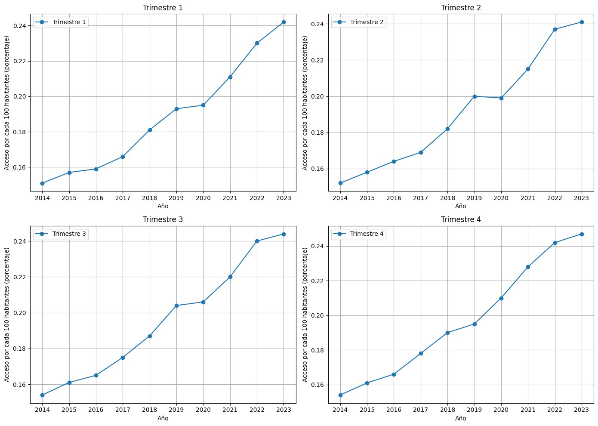
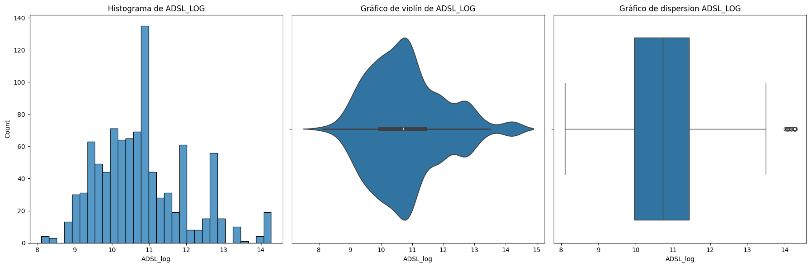
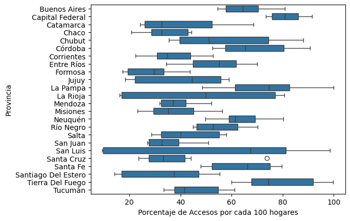

# Proyecto_Henry_Analisis_de_Datos
## Introduccion
Cada día se almacenan miles de terabytes de información, abarcando desde ubicaciones geográficas, preferencias y comportamientos en redes sociales, 
hasta compras y adquisición de servicios. En este contexto, los Analistas de Datos desempeñan un papel fundamental al recopilar, procesar y analizar 
estos vastos volúmenes de datos. Su objetivo principal es convertir millones de datos brutos en visualizaciones claras y comprensibles.

Los datos en bruto, por sí solos, tienen poco valor si no se interpretan adecuadamente. Aquí es donde los analistas de datos entran en juego. Utilizan 
herramientas y técnicas avanzadas para limpiar, transformar y modelar datos, extrayendo información valiosa que puede ser utilizada para tomar decisiones 
estratégicas. A través de visualizaciones de datos efectivas, los analistas permiten que los beneficiarios de sus servicios—ya sean empresas, gobiernos o 
individuos—puedan captar la información crucial en cuestión de minutos.

Estas visualizaciones no solo simplifican la complejidad de los datos, sino que también destacan patrones, tendencias y anomalías que podrían pasar desapercibidas 
en tablas y bases de datos tradicionales. Al presentar la información de una manera visualmente atractiva y fácil de entender, los analistas de datos facilitan 
la toma de decisiones informadas, impulsando así la eficiencia y eficacia en diversas áreas como el marketing, la atención al cliente, la gestión de inventarios, 
entre otros.

En resumen, en un mundo impulsado por datos, los Analistas de Datos son los traductores esenciales que convierten el caos de los datos en historias coherentes y 
significativas, permitiendo a los beneficiarios de sus servicios comprender rápidamente la información y tomar decisiones acertadas.
## Descripcion
En este proyecto tome el rol de Analista de Datos para poder ayudar a la empresa de telecomunicaciones ENACOM en un problema ficticio donde debia
generar un Analisis que les ayude a identificar tendencias en el aumento de accesos a conexion a internet en la ultima decada en Argentina
como tambien aportarles un Analisis para identificar patrones como tambien Visualizaciones que les ayuden a entender mejor los Datos
Para que puedan tomar las mejores decisiones con un trabajo captando los mejores puntos de datos que les pueda beneficiar para promocionar
sus servicios como tambien aprovechar oportunidades.
**

## Tabla de contenido 
1. [Introduccion](#Introduccion)
2. [Descripcion](#Descripcion)
3. [KPI Funcionamiento](#KPI Funcionamiento)
4. [Analisis de Datos](#Analisis)
5. [Contribucion y Colaboracion](#Contribucion y Colaboracion)
6. [Autores](#Autores)

## Analisis de Datos

**ACCESO POR CADA 100 INDIVIDUOS**

Conclusiones del Análisis de los Gráficos de Accesos por Trimestre
El conjunto de gráficos muestra la evolución del porcentaje de accesos por cada 100 habitantes, dividido por trimestres, desde el año 2014 hasta el 2023. Las conclusiones basadas en estos gráficos:

**1. Tendencia General**
En los cuatro trimestres, se observa una tendencia ascendente en el porcentaje de accesos por cada 100 habitantes a lo largo de los años. Esto indica un crecimiento continuo y sostenido en los accesos.
**2. Comparación entre Trimestres**
Todos los trimestres muestran una tendencia similar con un crecimiento constante desde 2014 hasta 2023.
La pendiente de crecimiento parece ser bastante consistente entre los trimestres, lo que sugiere que no hay un trimestre en particular que sea significativamente diferente en términos de crecimiento de accesos.
**3. Puntos de Crecimiento Notable**
A partir de 2017, todos los trimestres muestran un aumento más pronunciado en el porcentaje de accesos.
Entre 2020 y 2021, hay un notable incremento en el crecimiento, lo que puede estar asociado a factores como la pandemia de COVID-19, que pudo haber impulsado una mayor demanda de accesos debido a la necesidad de trabajar y estudiar desde casa.
**4. Año 2023**
El año 2023 muestra el valor más alto en cada trimestre, alcanzando alrededor del 0.24% de accesos por cada 100 habitantes.
**5. Estacionalidad**
No parece haber una estacionalidad marcada en los datos, ya que el crecimiento es relativamente uniforme entre los trimestres. Esto sugiere que los accesos han crecido de manera constante a lo largo de los años sin grandes fluctuaciones estacionales.
En resumen, los gráficos muestran un crecimiento continuo y sostenido en el porcentaje de accesos por cada 100 habitantes en Capital Federal a lo largo de los años, con un incremento notable a partir de 2017 y valores máximos en 2023. La tendencia es similar en los cuatro trimestres, sin una estacionalidad significativa.

**ACCESO POR LA TECNOLOGIA DE CONEXION ADSL**

**Conclusiones:**

**Histograma:**

La distribución de ADSL_LOG parece ser unimodal, con un pico claro alrededor del valor 11. Hay una asimetría hacia la derecha, con algunos valores altos pero mucho menos frecuentes.

**Gráfico de violín:**
Confirma la distribución observada en el histograma, con una alta densidad alrededor de 11. Muestra que hay variabilidad en los datos, con una mayor concentración de valores alrededor de la mediana.

**Gráfico de dispersión:**
La mediana de ADSL_LOG está cerca de 11. Hay varios valores atípicos (outliers) en el extremo superior, por encima de 13.
En resumen, la variable ADSL_LOG tiene una distribución asimétrica con una alta concentración de valores alrededor del 11, pero también presenta algunos valores atípicos altos.

**PORCENTAJE DE ACCESO POR CADA 100 HOGARES**

El gráfico que se presenta es un diagrama de cajas (box plot) que muestra la distribución de los accesos por cada 100 hogares en varias provincias argentinas.Las conclusiones son:

**Variabilidad de Accesos:**

Las provincias presentan una gran variabilidad en cuanto a los accesos por cada 100 hogares. Algunas provincias tienen una dispersión más amplia (e.g., Buenos Aires, Córdoba, Santa Fe), mientras que otras tienen una dispersión más estrecha (e.g., La Rioja, Mendoza).

**Medianas y Rangos Intercuartílicos:**

Provincias como Buenos Aires y Córdoba tienen medianas más altas, indicando un mayor número de accesos por cada 100 hogares. Provincias como Formosa y Santiago del Estero tienen medianas más bajas, indicando un menor número de accesos.

**Valores Atípicos:**

Se observan algunos valores atípicos, como en las provincias de Formosa y San Luis, que indican valores de acceso significativamente diferentes del resto de los datos.

**Comparaciones Entre Provincias:**

Buenos Aires y Córdoba parecen tener los mayores niveles de accesos por cada 100 hogares. Provincias como La Pampa y Tucumán tienen medianas similares, pero diferentes niveles de variabilidad.

**Rangos de Accesos:**

La mayoría de las provincias tienen rangos de accesos que varían considerablemente, lo que sugiere diferencias significativas en la conectividad dentro de las mismas provincias. En resumen, el gráfico muestra una diversidad considerable en los accesos por cada 100 hogares entre las diferentes provincias argentinas, con algunas provincias destacándose por tener una mayor conectividad y otras con menos accesos. La variabilidad dentro de las provincias también es notable, lo que indica disparidades internas en el acceso a servicios.
